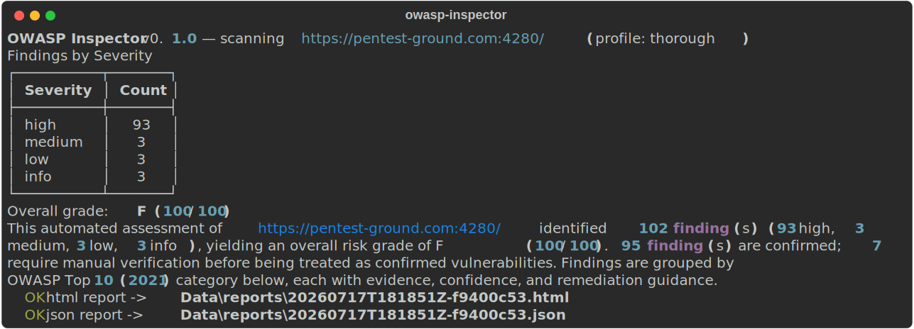
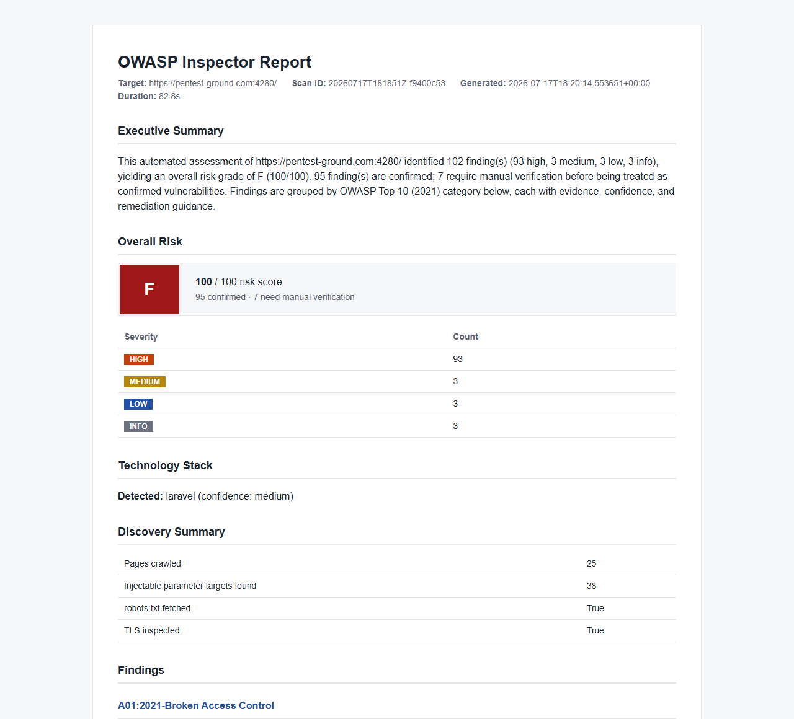

# OWASP Inspector

An automated OWASP Top 10 assessment engine. Give it one URL; it discovers the target and runs every applicable assessment module automatically, then writes a professional report.

```
owasp-inspector https://target.com
```

No scanner selection, no manual workflow — currently covers 9 of the 10 OWASP Top 10 (2021) categories:

- **A01 Broken Access Control** — CSRF (missing/removable/tampered token, method-based bypasses, token-entropy analysis) and a heuristic IDOR probe
- **A02 Cryptographic Failures** — cookies missing `Secure`, deprecated TLS versions, sensitive data in URLs, mixed-content form submission
- **A03 Injection** — SQLi (error-based, UNION, boolean/time-based blind, auth-bypass) and reflected XSS (context-aware payload sweep)
- **A04 Insecure Design** — framework debug-mode/stack-trace disclosure (Django, Flask/Werkzeug, PHP, ASP.NET, Rails, raw Java/Node traces)
- **A05 Security Misconfiguration** — missing security headers, unverifiable TLS certificates, exposed `.git`/`.env`/`.DS_Store`
- **A06 Vulnerable and Outdated Components** — version-disclosing headers, technology fingerprinting
- **A07 Identification and Authentication Failures** — session cookies missing `HttpOnly`/`SameSite`, login forms over plain HTTP
- **A08 Software and Data Integrity Failures** — cross-origin scripts/stylesheets loaded without Subresource Integrity, exposed source maps
- **A10 Server-Side Request Forgery** — heuristic canary probes

**A09 (Security Logging and Monitoring Failures) is not covered, on purpose.** It's about server-side log completeness and alerting — not something observable from outside via HTTP probing no matter how the target is scanned. Real DAST tools don't claim to test it either; this engine won't fake a check just to fill the slot.

Heuristic modules (IDOR, SSRF, and the URL-sensitive-parameter check) and anything not explicitly confirmed are clearly flagged as needing manual verification — see [Limitations](#limitations).

A few specialized checks aren't covered: stored/DOM/CSP-bypass XSS, SQLMap integration, CSRF's SameSite/CORS/CRLF/clickjacking checks, and second-session-based CSRF bypasses. See [`docs/ARCHITECTURE.md`](docs/ARCHITECTURE.md) for what's out of scope for each module and why.

Use it only on systems you own or have explicit permission to test.

**More docs:** [Architecture](docs/ARCHITECTURE.md) · [User Guide](docs/USER_GUIDE.md) · [Contributing](CONTRIBUTING.md)

## Screenshots

Real output from real scans — not staged mockups.

**A small, deliberately-vulnerable local Flask app** (unpatched SQL string concatenation, an unescaped reflected parameter, a token-less form, missing security headers), written just to produce these two images:

<p align="center"></p>

<p align="center"></p>

**A public DVWA (Damn Vulnerable Web Application) instance** on a legitimate, explicitly-authorized pentest-practice hosting service — a genuine internet-hosted target, not something local:

<p align="center"></p>

<p align="center"></p>

## Quick start

```bash
pip install -e .
owasp-inspector https://target.com
```

You'll be asked to confirm you're authorized to test the target, then the scan runs automatically: discovery (crawl, fingerprinting, TLS/robots/sitemap), every applicable module, then a report. By default it writes an HTML and a JSON report to `Data/reports/`.

```bash
owasp-inspector https://target.com --format json,markdown,html,pdf --profile stealth -o ./my-reports
owasp-inspector history                 # list past scans
owasp-inspector https://target.com -y   # skip the interactive authorization prompt (CI/automation)
owasp-inspector https://target.com --resume   # reuse cached discovery instead of re-crawling
```

| Option | Purpose |
|---|---|
| `--format, -f` | Comma-separated: `json`, `markdown`, `html`, `pdf` (default `html,json`) |
| `--profile, -p` | `fast`, `thorough` (default), or `stealth` — controls concurrency, timeouts, and per-host request pacing |
| `--max-pages` | Crawl page limit during discovery (default 40) |
| `--output-dir, -o` | Where reports are written (default `Data/reports/`) |
| `--yes, -y` | Skip the interactive authorization prompt (same as `OWASP_INSPECTOR_AUTHORIZED=1`) |
| `--resume` | Reuse the cached discovery result for this exact URL (if one completed in the last hour) instead of re-crawling. Only the discovery phase is cached — modules always run fresh, since they have no persisted internal progress to resume from. |
| `--respect-robots` | Honor `robots.txt` `Disallow` rules during the crawl. **Off by default** — robots.txt is a crawler-politeness convention for search engines, not access control, and this only runs after you've confirmed authorization. A real authorized test target with `Disallow: /` in its robots.txt otherwise blinds the crawl entirely. |

Copy `.env.example` to `.env` to tune SQLi/XSS/CSRF module concurrency — optional, the scanner works with none of it set.

## Docker

```bash
docker build -t owasp-inspector .
docker run --rm -e OWASP_INSPECTOR_AUTHORIZED=1 -v "$(pwd)/reports:/app/Data/reports" \
  owasp-inspector https://target.com --yes -o Data/reports
```

The interactive authorization prompt doesn't work in a non-interactive container, so `OWASP_INSPECTOR_AUTHORIZED=1` (or `--yes`) is required — the image never defaults this on for you. Mount a host directory over `/app/Data/reports` to get reports out of the container.

## Reports

Each scan produces a `ReportData` covering an executive summary, an overall risk grade (A–F, severity-weighted and confidence-discounted so a pile of low-confidence heuristic candidates can't outweigh one confirmed critical), findings grouped by OWASP category with evidence/remediation/references, technology and TLS/header discovery summary, and a scan timeline. Every finding that isn't a `confirmed` result is explicitly marked as needing manual verification.

`owasp-inspector history` lists past scans (target, grade, score, finding count) from a local append-only record — no database required.

## Limitations

- The tool performs active probing. It can generate many HTTP requests against a target.
- Findings are heuristic. Always verify reported issues manually before reporting them in a bug bounty or audit — every non-`confirmed` finding says so explicitly, and the IDOR/SSRF modules in particular are single-signal probes that cannot confirm a real vulnerability on their own (IDOR would need a second authenticated identity; SSRF would need out-of-band callback infrastructure this engine doesn't have).
- **0 findings usually means the wrong URL, not a broken scanner.** Homepages and marketing sites often have no injectable parameters; production sites are typically hardened.
- Network firewalls, WAFs, or unreachable hosts will produce empty results.
- A09 (Logging and Monitoring Failures) is not covered — see above, it isn't observable via external HTTP scanning at all, not a gap in effort.
- `--resume` only skips re-crawling; it does not resume a scan mid-module. If the process is killed while a module is running, re-run the scan (discovery will be reused if still fresh).

## License and responsibility

You are responsible for how you use this software. Unauthorized scanning of third-party systems may be illegal. Obtain written permission before testing any application you do not own.
